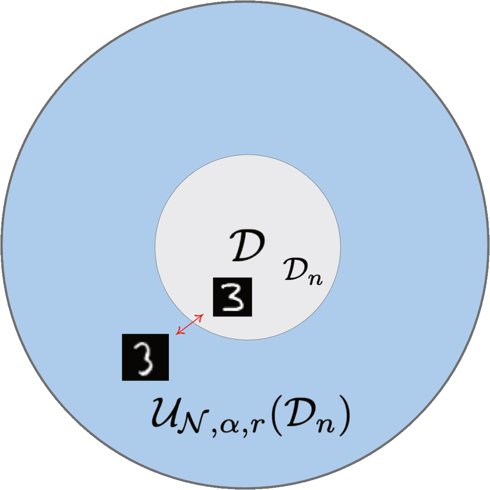

# Holistic Robust Neural Networks (HR)

<p align="left">
  
   
    
</p>

```python
git clone https://github.com/MohammedAmine-Bennouna/HRLearning.git
```

### This code base is an open-source implementation of "Certified Robust Neural Networks: Generalization and Corruption Resistance".

We introduce a novel learning approach which enjoys certified protection against data poisoning, evasion attacks, and statistical error based on Distributionally Robust Optimization (DRO).
Our approach is designed to protect simultaneously against all aforementioned types of data corruptions which may arise during the training and deployment of deep learning models. Protection is controlled by three robustness parameters: 
* $\alpha$: controls protection against generic data poisoning attacks at training time. This encompasses any kind of corruption to the training instances; for instance training examples that have been obscured or which are wholly misspecified.
* $\mathcal{N}$: provides protection against perturbations to the testing examples, also known as evasion attacks. A common and well-studied example of evasion is the adversarial attack. Here we choose $\mathcal{N} =$ { $\delta: ||\delta|| \leq \epsilon$ }, where $\epsilon>0$. 
* $r$: protects the network from overfitting to the training instances of a small random sample. The parameter thus ensures strong generalization given a small data size.

We provide a robust loss function that can be automatically differentiated in Pytorch as well as framework-agnostic importance weights that can be integrated with Tensorflow or another deep learning framework. Doing so involves minimal disruption to standard training pipelines.

Click here for a **Colab tutorial applying HR for MNIST classification**: 

<p align="left"><a href= "https://colab.research.google.com/drive/1d5BZvCDGWHS_UxFR77YneKGB3mMGR-tY?usp=sharing">
  </a>
</p>

## Background

HR assumes there is a true clean distribution $\mathcal{D}$, from which we do not obtain samples directly. Rather, we have access only to a poisoned dataset $\mathcal{D}_n$. 

Given that $\mathcal{D}_n$  is unlikely to correspond exactly to $\mathcal{D}$ we have that the optimizer:

```math
\begin{equation}
\underset{\theta \in \Theta}{\text{min}} \: \mathbb{E}_{(X, Y) \sim \mathcal{D}_n} [\ell(\theta,X, Y)]
\end{equation}
```

is unlikely to correspond to the parameters that optimize the out-of-sample loss.

HR mitigates this issue by constructing a ball (or ambiguity set) $\mathcal{U}_{\mathcal{N}, \alpha, r}(\mathcal{D_n})$  around the samples and optimizing the worst-case loss realizing in this set. With the help of our three robustness parameters $(\mathcal{N}, \alpha, r)$, HR respectively protects against the worst-case evasion, poisoning and small-sample overfitting that the model can experience:

```math
\begin{equation}
\min _{\theta \in \Theta} \max_{u \in \mathcal{U}_{\mathcal{N}, \alpha, r}(\mathcal{D}_n)} \mathbb{E}_{(X, Y) \sim u}[\ell(\theta, X, Y)]
\end{equation}
```

<p align="center">
  
</p>

The HR objective function is an upper bound on the test performance with high probability $1-e^{-rn+O(1)}$ when less then a fraction $\alpha$ of all $n$ samples are tampered by poisoning, and the evasion corruption is bounded within the set $\mathcal{N}$.

The parameters $\mathcal{N}, r$ and $\alpha$ are important design choices. If one suspects that one source of overfitting is more dominant than others, they may choose a higher value for a certain parameter. For instance, if it is believed that more noise is present in the data, then greater robustness to noise (that is, higher $\epsilon$ or a broader set $\mathcal{N}$) may be desired. If the dataset is very small in size, then higher $r$ may be preferred as the observed empirical distribution is less likely to be a good proxy for the true unknown distribution. If the data is not very clean, higher $\alpha$ may be desired to achieve robustness against poisoned training examples.

The interaction between each parameter is also relevant. For example, when used in conjunction $\mathcal{N}$ and $r$ can provide protection to the well-known phenomenon of  [robust overfitting](https://arxiv.org/abs/2002.11569), which occurs when adversarially robust models strongly overfit towards the end of training. Similarly, robustness to poisoning and statistical error via $\alpha$ and $r$ can be used when only a small, low-quality dataset is available.

## Training of HR Neural Networks in Pytorch

 HR can be implemented for neural network training with minimal disruption to typical training pipelines. The core output of the code is a Pytorch loss function which can be optimized via ordinary backpropagation commands. For example, see below for a contrast between regular training and HR training.
 
### Natural training

```python

criterion = F.cross_entropy(reduction = 'mean')

def train(model, device, train_loader, optimizer, epoch):
    model.train()
    for batch_idx, (data, target) in enumerate(train_loader):
        data, target = data.to(device), target.to(device)
        optimizer.zero_grad()
        loss = criterion(model(data), target)
        loss.backward()
        optimizer.step()
        
 ```

### HR training

```python

criterion = F.cross_entropy(reduction = 'none') # note the change from mean -> none

########### HR Model Instantiation ###############

from HR import * 

α_choice = 0.05 
r_choice = 0.1
ϵ_choice = 0.5
       
HR = HR_Neural_Networks(NN_model = model,
                        learning_approach = "HD",
                        train_batch_size = 128,
                        loss_fn = criterion,
                        normalisation_used = None,
                        α_choice = α_choice, 
                        r_choice = r_choice,
                        ϵ_choice = ϵ_choice)

########### Training Loop ###############

def train(HR, model, device, train_loader, optimizer, epoch):
    model.train()
    for batch_idx, (data, target) in enumerate(train_loader):
        data, target = data.to(device), target.to(device)
        optimizer.zero_grad()

        HR_loss, _ = HR.HR_criterion(inputs, targets, device)

        HR_loss.backward()
        optimizer.step()
```
